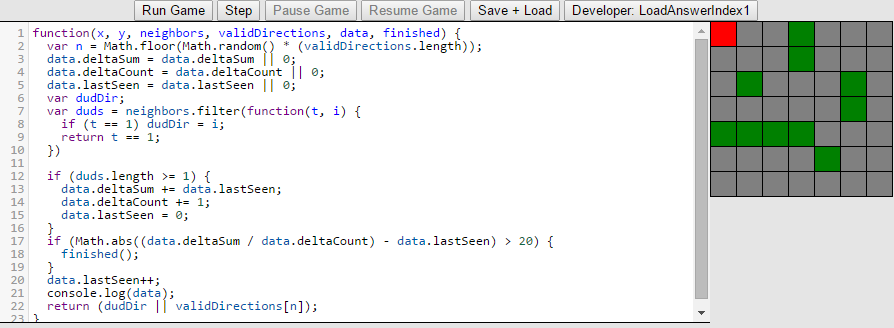

# Introduction
Automated processes are all around us. In our world, automation plays a keep role, from manufacturing to email filters.  At the heart of almost all automation there is an autonomous agent.  An autonomous agent is a computer program or software entity which has the ability to perceive its environment and act independently. More specifically, an autonomous agent can do at least some of the following \autocite{russell2010}:   

- perceive their environment  
- operate autonomously  
- can at perpetually  
- pursue goals and   
- adapt to the environment  

Autonomous agents can be categorized into groups based on the capabilities.Some of the common classes of autonomous agents are Simple reflex agents, model-based agents, goal-based agents and utility-based agents\autocite{russell2010_types}. Simple reflex agents act based on only their current environment.  Model-based agents create a perception of their environment which the can not see called a model. The model is stored in the agent and the agent choses actions based on it. Goal-based agents act on information given to them which describes desirable outcomes.  Utility-based agents choose actions which yield the most desirable outcome. This is a more sophisticated system than goal-based agents and is why they are considered a more "intelligent" agent than the other types listed. There are several other classes of Autonomous agents according to some classifications  \autocite{franklin} which won't be covered here.  

There are many examples of autonomous agents in our daily lives.  For example, an email filter which identifies unwanted email could be designed as an autonomous agent.  It could be a utility-based agent which compares new emails with email marked as undesirable by a user and decides if the email is most likely desirable or not. Then environment of the email filter would be everything in the email client including user preferences, email categories, etc. It can perceive its environment, work continuously, and complete goals. This is a fairly abstract example. A more traditional example of autonomous agents are robots. From the Roomba vacuum \autocite{roomba} to robotic arms, to autonomous helicopters \autocite{bekey2005}. It is clear how these robots behave as autonomous agents. They each have goals (E.x. vacuuming the room, painting a surface, performing search and rescue), they each interact with their environment, and can perform their function for extended periods of time without external intervention. Other applications of autonomous agents include air traffic control \autocite{jennings1998}, autonomous trading agents \autocite{toulis2006}, medical applications such as patient monitoring and diagnosis\autocite{visell}, customer help desk, personal shopping assistant\autocite{tran}, and many more.  In this paper we will examine the specific implementations of simple autonomous agents to get a better understanding of the core concepts regarding autonomous agents.

## Structure of an Autonomous Agent
An autonomous agents is essentially made of three parts: sensors, actuators, and state \autocite{russell2010}. Sensors are anything that an autonomous agent can perceive its environment through. Consider the Roomba vacuum. It has sensors that help it detect walls, corners, and obstacles \autocite{roomba}. Actuators are anything by which an autonomous agent interacts with its environment. This includes things which help an autonomous agent change its own state in the environment. The Roomba's actuators might include a vacuum, motors (which give it locomotion) and some lights which signal how much battery it has, whether it is on or not, etc. State can be considered the "knowledge" of an autonomous agent. As mentioned, some autonomous agents don't keep track of their state or the state of the environment but others do. An autonomous agent uses stored information to help it make decisions or accomplish goals.

# Implementations
## Overview
As mentioned, all autonomous agents (AA) are implemented using software. Some autonomous agents are solely made of software such as an air traffic control system, whereas other AA like the Roomba have external components to interact with and perceive their environment. There are two main considerations to make before implementing an autonomous agent. One must consider what the environment of the AA is, as well as how can the AA interact with the environment. In this paper we will use an interactive coding tool called AA Factory, created by Sean Usick and I. AA Factory is an educational Chrome web browser application which allows users to create and test autonomous agents in a simulated environment. The users are given a goal or task and have to create an autonomous agent which completes the task.  The autonomous agents are created by writing JavaScript code in the app's built in editor. 

### Environment considerations
When considering to implement an autonomous agent one must consider the limitations of the environment, entities in the environment and its structure. For example, if a robot was being designed to travel to Jupiter, it would be critically important to consider the increased gravitational force. The structure of the environment is how the environment is built and what are its boundaries. In AAFactory the structure of the environment will be a two dimensional grid. In the autonomous email filter example, the environment consisted of a collection of emails, sorted into categories and likely some form of user setting or preferences. There are the things that all agents in the environment will be get to interact with and/or know about to various degrees. These things must be considered as well because they will have a strong control on how one implements an autonomous agent.

### Agent considerations
When implementing an autonomous agent one must throughly understand how an AA perceives their environment as well as how they can interact with it. In some cases an autonomous agent will be fully aware of its environment (the autonomous email agent) but the majority of the time it will only be able to receive partial information about the environment. The things which an agent can be aware about may be controlled by factors of the environment/situation[^AC1] or may be controlled by the design of the agent. For example, if one was constructing a robot, by adding sensors to the robot's feet it would be able to perceive the stability of the ground. Secondly, one must consider the ways in which the agent can interact with the environment. This is affected in the same ways as the perceptions of the AA. Often an AA won't be able to perform the exact action which will complete it's goal, therefore it will have to use alternate methods to achieve its goal. To continue with the autonomous search and rescue vehicle example, it would satisfy the AA's goals to help all known victims immediately, but obviously that isn't possible. The AA can only help one victim at a time, and it must do that by moving to that victim's location and helping it. 

[^AC1]: An autonomous search and rescue vehicle can't know the location of injured people without finding them first.

## Seek and Destroy
The first autonomous agent we will implement will be a seek and destroy agent[^SD1]. As mentioned this environment will be a two dimensional grid. In this environment there will be a single autonomous agent which will search for 'duds' and destroy them. A dud is what we will call the simple agents which move around the map slowly and randomly[^SD2].  The AA will have to find and destroy all the AA and then signal that it is complete. A dud is destroyed when the AA moves into the same tile which contains the dud.  

To implement this autonomous agent we will make a single method. This method will determine how our autonomous agent will move each frame. In AA Factory this method is then interpreted and used to control the AA when the simulation is run. The AA will be developed incrementally. This will illustrate how the structure of an AA and the natural progression of intelligence from a simple reflex agent to a goal based agent.

AAFactory gives us the following skeleton to work off from.  

     

As mentioned, there is one function, with a several parameters and it returns a direction. All the possible directions are stored in an object called `Directions` and here are their names:
\begin{minted}[linenos,
               frame=lines]{javascript}
var Directions = {
  UPLEFT: 0,
  LEFT: 1,
  DOWNLEFT: 2,
  UP: 3,
  // center corresponds the the reference point itself.
  CENTER: 4,
  DOWN: 5,
  UPRIGHT: 6,
  RIGHT: 7,
  DOWNRIGHT: 8,

}
\end{minted}
So, in figure \ref{skeleton} our AA will simply stay where it is. Here are the definitions of the parameters of the function:  

`x`
:   the horizontal location of the AA.  

`y`
:   the vertical location of the AA. Note: a 0 `y` value is in the top of the grid.  

`neighbors`
:   An array of all the adjacent tiles. It can be referenced in the following manner: `neighbors[Directions.UP]`. This will select the neighboring tile which is about the AA.  

`validDirections`
:   An array of the valid directions the AA can move. By using this array to select a direction to move you will avoid moving in an invalid direction.  

`data` 
:   this is an object which an AA can store information in.  

`finished`
:   a method which the AA must call to signal that it is completed. Calling this method before all the duds are destroyed will cause it to lose.

[^SD1]: An equivalent example could be a search an rescue agent. The behavior would be almost identical, except rather than destroying, a dud on contact, it would rescue them.
[^SD2]: Duds are not autonomous agents. They do not respond to their environment.